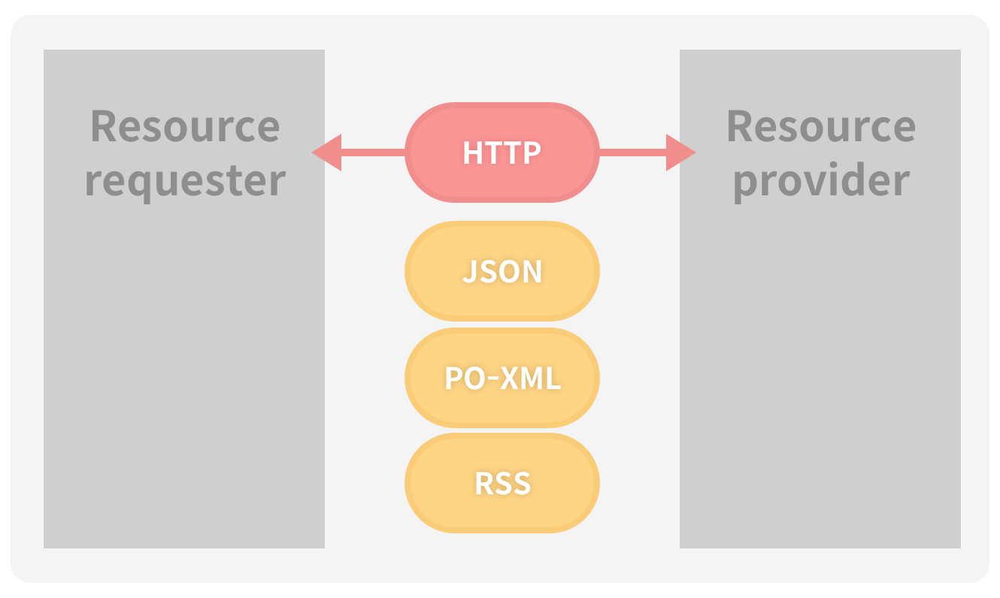
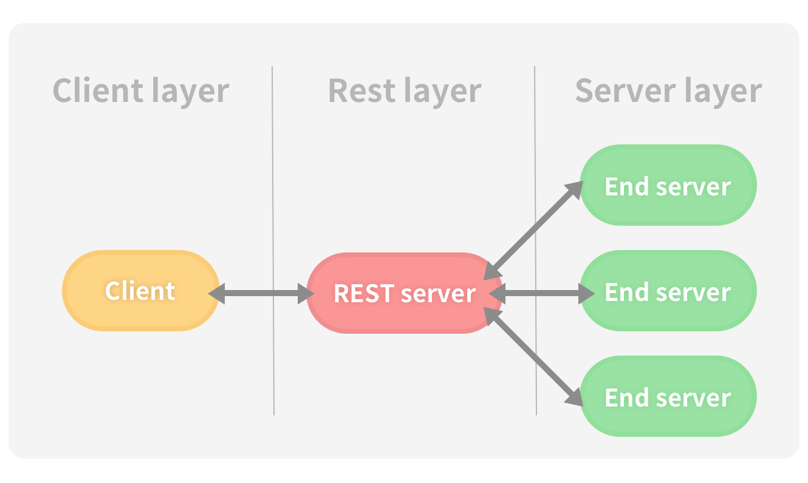
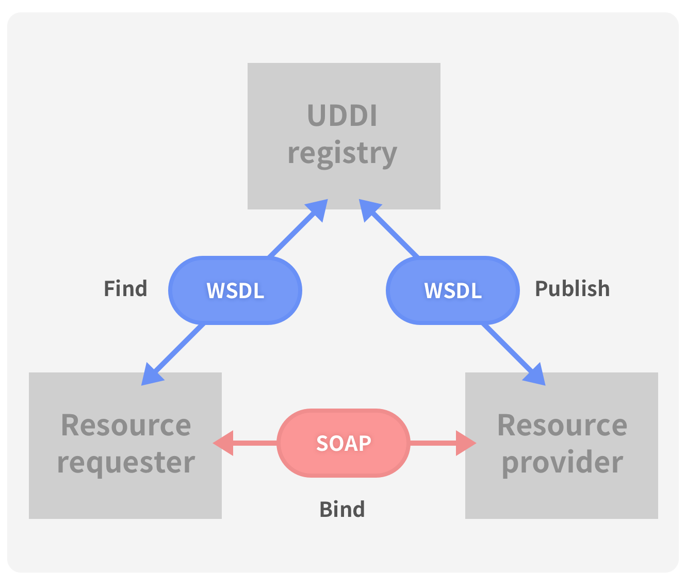
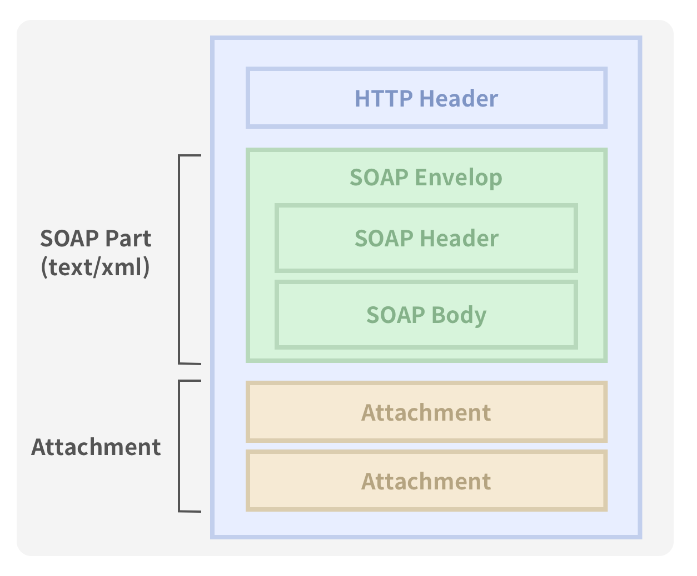

# REST
## 1. 정의
### HTTP URI + HTTP Method
REST(Representational State Transfer)

- www와 같은 분산 하이퍼미디어 시스템을 위한 소프트웨어 아키텍쳐의 한 형식 
- 네트워크 아키텍처 원리(자원을 정의하고 자원에 대한 주소를 지정하는 방법)의 모음    
- URI와 HTTP 메소드를 이용해 객체화된 서비스에 접근하는 것

## 2. 특징

### Stateless  
직관적인 객체의 접근으로 서비스를 처리한다. 쿠키/세션 정보가 필요하지 않기 때문에 서비스의 자유도가 높아지며 로드밸런싱 등의 유연한 아키텍쳐의 적용이 가능하다.

- 각 요청간 클라이언트의 Context는 서버에 저장되어서는 안된다.
- 모든 요청은 일회성을 성격을 갖는다. 이전의 요청에 영향을 받지 않아야한다. 

### HTTP URI를 통한 Resource 지정
- 모든 자원은 HTTP URI를 통해 Resource로 표현한다.
- 객체에 대해 유일하고 직관적인 URI를 통해 접근한다. 

anohk.com의 blog의 35번 포스트 정보에 접근하려면 다음과 같은 URI를 사용한다.  
`www.anohk.com/blog/post/35`

> 아래과 같은 방법은 RESTfull한 방법이 아니다.  
`www.anohk.com/blog/post/show/1`

### 자원에 대한 행위는 HTTP Method로 표현한다.
URI를 사용해 자원을 찾고, 이에 대한 명령(CRUD를 명시)을 내린다.  
HTTP가 제공하는 GET/PUT/POST/DELETE 메서드를 이용해 서비스를 제공한다. 

| HTTP Method  | 의미 |
|---|---|
| POST | CREATE |
| GET | RETRIVE |
| PUT | UPDATE |
| DELETE | DELETE |

이외의 추가적인 메서드를 더 제공한다. 

> **PATCH**  
PUT은 해당 자원 전체를 교체하는 의미를 갖고있다. 자원의 일부만 변경하기 위해서 **PATCH** 라는 메서드를 사용한다. 이는 update 이벤트에서 PUT 메서드보다 의미적으로 적합하다는 평을 받고있다.

### 컴포넌트 중계
REST server가 Client와 End server의 중간에서 중계의 역할을 할 수 있기 때문에 Client가 End server의 위치를 몰라도 서비스를 이용할 수 있다.  

## 3. 장점
- 기존의 웹 인프라를 그대로 이용할 수 있다.(방화벽, 장비 요건 불필요)
- Open API를 제공하기 쉽다.
- 언어, 플랫폼에 중립적이다.
- 서버와 클라이언트를 독립적으로 구현하여 확장성 향상  
- 각각의 요청에 독립적이다.(부가적인 전송 레이어가 필요하지 않음. 세션, 쿠키 불필요)
- SOAP 보다 개발하기 단순함
- 추가적인 메시지 계층이 없음

## 4. 단점
- 정확한 표준이 없기 때문에 관리가 어렵다. 
- CRUD만으로 분류할 수 없는 작업이 존재한다.
- 분산환경에는 유용하지 않다. 
- HTTP 통신 모델만 지원함 

# SOAP
## 1. 정의
SOAP(Simple Object Access Protocol)

SOAP은 일반적으로 널리 알려진 HTTP, HTTPS, SMTP 등을 통해 **XML** 기반의 메시지를 컴퓨터 네트워크 상에서 교환하는 프로토콜이다. 

## 2. SOAP 아키텍쳐

UDDI 레지스트리를 통해 웹서비스를 등록(Publish)/탐색(Find)하고, 바인딩(Bind)하여 사용한다. 

- 서비스 요청자가 SOAP로 인코딩하여 웹 서비스 요청을 서비스 제공자에 전달.
- 서비스 제공자는 이를 디코딩하여 적절한 서비스 로직을 수행시켜 그 결과를 SOAP로 인코딩하여 반환

> UDDI
> 웹서비스를 등록하고 검색하기 위한 저장소로 웹서비스를 공개적으로 접근, 검색이 가능하도록 공개된 레지스트리
> 
> 모든 데이터가 XML로 표현되고, 데이터를 다루는 오퍼레이션들이 WSDL로 정의되면, UDDI라는 전역적 서비스 저장소에 등록되어 

### SOAP 메시지 구조

## 3. 장점
- 기존 원격 기술들에 비해 프록시, 방화벽에 구애받지 않고 쉽게 통신 가능
- 플랫폼과 프로그래밍 언어에 독립적
- 웹서비스를 제공하기 위한 표준(WSDL, UDDI, WS-*)이 잘 정립되어있음
- 에러 처리에 대한 내용이 기본적으로 내장되어 있음
- 분산 환경에 적합

## 4. 단점
- 복잡한 구조로 인한 오버헤드가 있으며, 이로인해 SOAP의 확장을 저해
- REST에 비해 상대적으로 무겁고 느리다
- 개발 난이도가 높아 개발 환경의 지원 필요

---

| SOAP | ROA |
| --- | --- |
|  서비스 지향 아키텍쳐 | 자원 지형 아키텍쳐 |
| SOA 구조에 따라 UDDI 레지스트리를 통해 웹서비스를 등록, 탐색하고 바인딩하여 이용 | 리소스를 등록하고 저장해두는 중간 매개체 없이 리소스 제공자가 직접 리소스 요청자에 제공 |
| 기계 우선적으로 이해하기 쉬운 구조 - 환경설정 및 개발 환경 필요 | 사람이 이해하기 쉬운 구조 - 별도의 개발/실행 환경 불필요 |