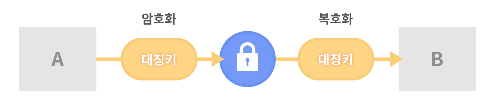
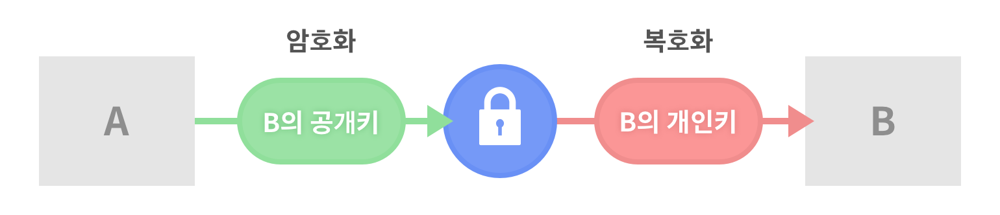
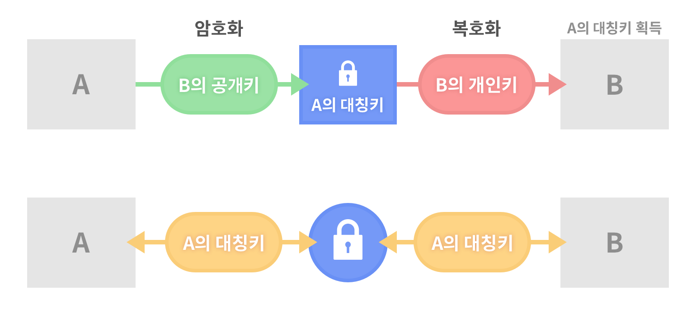

# 네트워크

## TCP  
전송 제어 프로토콜(Transmission Control Protocol)  
정보를 주고받을 때 지켜야할 규칙
인터넷 프로토콜 스위트의 핵심 프로토콜 중 하나로, IP와 함께 TCP/IP라는 명칭으로 불리기도 한다.  
TCP는 근거리 통신망이나 인트라넷, 인터넷에 연결된 컴퓨터에서 실행되는 프로그램 간에 일련의 옥텟을 안정적으로, 순서대로, 에러없이 교환할 수 있게 한다.
TCP는 웹 브라우저들이 월드 와이드 웹에서 서버에 연결할 때 사용되며, 이메일 전송이나 파일 전송에도 사용된다.

## IP  
인터넷 프로토콜(Internet Protocol)
인터넷을 사용할 때 지켜야할 규칙

TCP/IP : 인터넷으로 정보를 주고받을 때 지켜야할 규칙

## URL
Uniform Resource Locator

- [Protocol]://[Host]:[Port]/[Path]
- http://www.daum.net:80/map
- ftp://id:pw@192.168.1.10:777/mydir
- file://localhost/movie/baseball.avi

### Protocol

- 프로토콜
- 통신규약
- 장비 사이에서 메세지를 주고 받는 양식과 규칙의 체계 즉, 통신(네트워킹)할 때 정해진 메세지 규칙
- http, https, ftp, sftp, telnet, ssh, ssl, smtp....

 

#### HTTP METHOD

- **GET** 서버에 정보 요청
 - 요청사항을 url에 붙여서 보낸다.
 - 캐싱을 동작시킨다. 
 자주 쓰는 데이터들을 주기억장치에 올려놓고 빨리 정보를 꺼내올 수 있다. : 캐시
실시간으로 변하는 데이터는 정확한 데이터를 받기 어렵다. : 최신의 데이터 받을 수 없음
새로고침: 캐싱된 데이터 말고 서버에서 새로 데이터를 받아와
- **POST** 부가적 정보를 붙여 요청
 - 요청사항을 패킷바디에 붙여서 보낸다.
 - GET으로 보낼 수 있는 정보의 용량이 한정되어있기 때문에 POST방식을 사용한다. 
 - 캐싱하지 않은 데이터를 받아온다. (서버에는 부담이 될것 but 최신화된 데이터를 받아올 수 있다.)
 
- **PUT** 데이터를 서버로 보냄
- **DELETE** 정보 삭제 요청
- **HEAD** 요청에 어떤 메소드로 어떤 프로토콜을 사용했는지 정보가 있음
- TRACE
- OPTIONS
- CONNECT

__Secure Shell ssh__  
Secure Shell
네트워크 상의 다른 컴퓨터에 로그인하거나 원격 시스템에서 명령을 실행하고 다른 시스템으로 파일을 복사할 수 있도록 해 주는 응용프로그램 또는 그 프로토콜
telnet의 대용목적으로 설계

__Secure Socket Layer ssl__  
웹서버와 브러우저 사이의 보안을 위한 프로토콜

### Host
호스트: 네트워크에 연결된 장치
호스트 이름: 네트워크에 연결된 장치에 부여되는 고유한 이름
ex) IP 주소, 도메인 주소, MAC 주소 등등

__IP address__  
internet protocol address: 인터넷을 사용할때 부여되는 고유한 주소
컴퓨터 네크워크에서 장치들이 서로 인식하고 통신을 하기 위해서 사용하는 번호
(통신사에서 IP주소 할당해줌. 

__Domain address__
네트워크상에서 컴퓨터를 식별하는 호스트 이름
(IP주소를 알아보기 어려우니까 사람이 알아볼 수 있는 이름을 만들었다)
= 컴퓨터가 알아듣지 못함 
 
__DNS__  
Domain Name System
호스트의 도메인 이름을 호스트의 네트워크 주소로 바꾸거나 반대의 변환을 수행

__MAC address__  
물리주소 만들어질때 갖고나오는 하드웨어에 직접 부착되서 나오는 주소.
Media Access Control Address
네트워크 어댑터에 부착된 식별자

### Port
가상의 논리적 통신 연결단
번호로 구분

FTP  
File Transfer Protocol
- 서버와 클라이언트 사이에 파일전송을 위한 프로토콜
- 보안에 매우 취약
- 현재는 FTPS,SFTP, SSH 등을 사용

SMTP  
Simple Mail Transfer Protocol
인터넷에서 메일을 보내기 위한 프로토콜 
팝프로토콜

## Network OSI 7 layer

국제 표준화기구에서 개발한 컴퓨터 네트워크 프로토콜 디자인과 통신을 계층으로 나누어 설명한 것

packet: 데이터의 전송단위 - 형식화된 블록임
segment: 패킷 앞뒤로 붙은것 - 데이터에 관련된 정보가 담겨있음

신호가 손실되었을때 그게 잘못된건지 어떻게 알 수 있나?
[페리티 비트](https://ko.wikipedia.org/wiki/%ED%8C%A8%EB%A6%AC%ED%8B%B0_%EB%B9%84%ED%8A%B8)

## 암호화

#### 대칭키

- **대칭키**를 송신자와 수신자가 같이 사용한다.
- 단일 키 사용 
- 암호화와 복호화에 같은 암호키를 사용하는 알고리즘
- DES, AES, SEED 등

-

#### 비대칭키

- 데이터 송신자는 **수신자의 공개키**로 암호화를 하고, 수신자는 **자신의 개인키**로 복호화한다.
- 쌍으로 이루어진 두 키를 사용 (공개키 : 개인키)
- 공개키 기법은 시간이 오래 걸리기 때문에 SSL에서는 대칭키를 보내는 용도로만 사용한다.
- RSA 등 

#### SSL의 대칭키와 비대칭키의 조합

- 공개키 기법으로 대칭키를 주고 받은 후 해당 대칭키로 암호화된 데이터를 주고받는다.
- 공개키 기법으로 대칭키를 주고 받기 때문에 대칭키는 안전하게 보호되고, 실제 암복호화는 대칭키로 하기 때문에 비용이 적게 든다.
- 대칭키는 임시 대칭키로 매번 랜덤으로 선택되기 때문에 유출되어도 다시 사용할 일이 없어 안전하다.

#### 해시
- 임의의 데이터를 고정된 길이의 데이터로 매핑하여 원래의 입력값과의 관계를 찾기 어렵게 만든 것
- SHA, MD5 등
- 원래 값을 알 수 없다고 하지만, 패턴으로 알아낼 수 있음.

